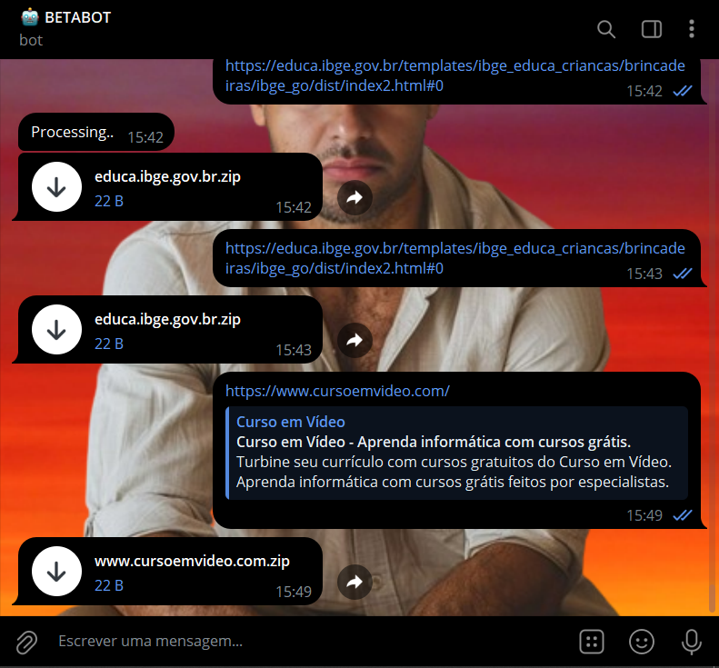

# WEBDOWNLOADERBOT
🤤ESSE BOT DO TELEGRAM É ÚTIL PARA FAZER BACKUP DO CONTEÚDO DE PÁGINAS WEB DE FORMA RÁPIDA E SIMPLES, SEM PRECISAR SALVAR MANUALMENTE CADA COMPONENTE.

 <br>

## DESCRIÇÃO:
O bot criado com o Telegraf tem a função de **baixar e compactar os componentes de uma página web** em um arquivo ZIP e enviá-lo de volta ao usuário. 

1. **Recebimento de URL**:
   - O usuário envia um URL de uma página web para o bot.
   - O URL deve começar com `http` ou `https`.

2. **Processamento da Página Web**:
   - O bot faz o download do conteúdo da página web, incluindo arquivos de HTML, CSS, imagens, scripts e links.
   - Ele analisa o HTML para identificar todos os arquivos referenciados, como imagens, folhas de estilo e scripts.

3. **Criação do Arquivo ZIP**:
   - O bot compila todos os componentes da página em um arquivo ZIP.
   - O arquivo ZIP inclui a página HTML e todos os arquivos referenciados, preservando a estrutura de diretórios.

4. **Envio do Arquivo ZIP**:
   - O bot envia o arquivo ZIP compactado de volta para o usuário.
   - O usuário pode então baixar e acessar todos os componentes da página web compactados em um único arquivo.

## EXECUTANDO O PROJETO:
1. **Editar o código:**
   - Certifique-se de substituir "seu_token_aqui" pelas informações corretas das suas credenciais em `CODIGO/.env`, o qual pode ser obtido por meio do [@BotFather](https://t.me/BotFather).
   
2. **Instalando as Depêndencias:**
   - Para instalar as dependências listadas no arquivo "package.json", você pode usar o comando `npm install` no terminal. Certifique-se de estar no diretório do seu projeto onde o arquivo "package.json" está localizado (`CODIGO`). O npm irá ler o arquivo "package.json" e instalar todas as dependências listadas nele. 

   ```bash
   npm install
   ```

3. **Inicie o Bot:**
   - Para usar o `NODE`, inicie o bot com o seguinte comando:
    ```bash
    npm start
    ```

    - Para usar o `NODEMON`, inicie o bot com o seguinte comando:
    ```bash
    npm test
    ```

4. **Interagindo com o Bot:**
   1. **Inicie o Bot**:
      - Envie o comando `/start` para o bot. Ele responderá com uma mensagem de boas-vindas e um botão que leva ao código-fonte do bot no GitHub.

   2. **Envie uma URL**:
      - Envie um URL de uma página web para o bot. Por exemplo: `https://www.google.com`.

   3. **Aguarde o Processamento**:
      - O bot processará o URL enviado, baixará os arquivos e criará o arquivo ZIP.
      - Ele notificará quando o processamento estiver concluído e enviará o arquivo ZIP.

   4. **Baixe o Arquivo ZIP**:
      - Receba e baixe o arquivo ZIP enviado pelo bot contendo todos os componentes da página web.

## NÃO SABE?
- Entendemos que para manipular arquivos em muitas linguagens e tecnologias relacionadas, é necessário possuir conhecimento nessas áreas. Para auxiliar nesse aprendizado, oferecemos cursos gratuitos disponíveis:
* [CURSO DE TELEGRAF](https://github.com/VILHALVA/CURSO-DE-TELEGRAF)
* [CURSO DE JAVASCRIPT](https://github.com/VILHALVA/CURSO-DE-JAVASCRIPT)
* [CURSO DE NODEJS](https://github.com/VILHALVA/CURSO-DE-NODEJS)
* [CONFIRA MAIS CURSOS](https://github.com/VILHALVA?tab=repositories&q=+topic:CURSO)

## CREDITOS:
- [PROJETO INSPIRADO NO "WebDownloaderBot"](https://github.com/samadii/WebDownloaderBot)
- [PROJETO FEITO PELO VILHALVA](https://github.com/VILHALVA)

